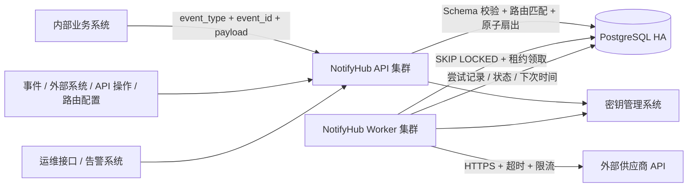
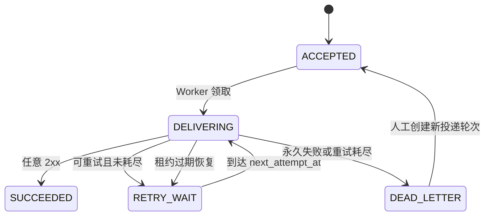
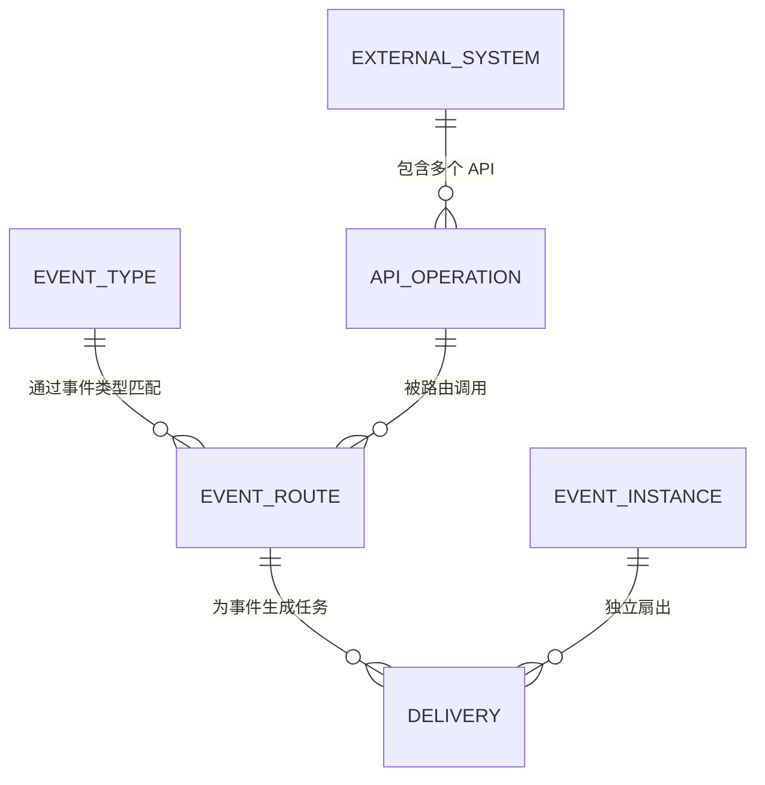

# NotifyHub 企业级 API 通知系统实施规划

> 文档状态：V1 实施建议
> 更新日期：2026-07-15
> 依据：原始需求图片、[PRD.md](./PRD.md)、[TECHNICAL_DESIGN.md](./TECHNICAL_DESIGN.md)

## 1. 结论摘要

V1 建议实现为一个“事件路由 + 可靠 HTTP 投递平台”，但不扩展为通用工作流引擎：

- 内部业务系统只提交版本化的标准事件，不直接指定外部 URL。
- NotifyHub 通过“事件类型 → 路由订阅 → API 操作”决定调用哪些外部 API。
- 路由上的受限模板把标准事件转换为不同 API 所需的 Header、Query 和 Body。
- NotifyHub 管理外部系统、API 操作、鉴权、超时、限流和重试策略。
- API 在任务和请求快照可靠写入 PostgreSQL 后返回 `202 Accepted`。
- Worker 从 PostgreSQL 任务表领取任务，异步调用外部 HTTPS API。
- 投递语义为“至少一次”：优先不漏送，允许极端故障窗口下重复投递。
- 任意 `2xx` 视为成功；不解析响应 Body，也不让响应 Body 驱动内部业务状态。
- 网络错误、超时、`408`、`429`、`5xx` 自动重试；普通 `4xx`、安全错误和配置错误进入死信。
- 长期不可用时有限重试、告警、死信和人工重放，不无限重试。
- 在需求给出的常态 10 QPS、峰值 50 QPS、10 万积压规模下，V1 使用 PostgreSQL 任务表，不引入 Kafka 或 RabbitMQ。

## 2. 必须先统一的产品语义

### 2.1 “不关心返回值”的定义

建议定义为：

1. 业务系统不等待外部 API 的同步响应。
2. NotifyHub 不解析响应 Body，不依赖供应商自定义返回字段。
3. HTTP 状态码仍是投递协议的一部分：只有 `2xx` 表示供应商确认接收。
4. `408`、`429`、`5xx` 表示暂时失败，应该重试。
5. 普通 `4xx` 通常表示请求永久无效，直接进入死信，避免无意义重试。

不建议把“收到任意 HTTP 响应”视为成功。对库存变更等场景，供应商返回 `500` 只说明请求到达 HTTP 服务，并不代表通知被接受；若此时停止重试，会违背“可靠送达”的目标。

### 2.2 投递保证

V1 对外承诺“至少一次”，不承诺“仅一次”：

- 已返回 `202` 的任务不会因 API 或 Worker 进程重启而丢失。
- 任务会被尝试投递，直至成功或按规则进入死信。
- 若供应商已经处理请求，但成功响应在网络中丢失，NotifyHub 会重试，可能造成重复。
- 如果供应商支持幂等键，NotifyHub 应把稳定的业务事件 ID 写入其指定的幂等 Header。

### 2.3 受理成功不等于投递成功

`202 Accepted` 只表示：请求已经校验并可靠持久化，由 NotifyHub 接管后续处理。它不表示供应商已经接收或完成业务处理。

## 3. 系统边界

### 3.1 V1 负责

- 内部调用方认证、授权和限流。
- 版本化事件目录、JSON Schema 校验和事件幂等受理。
- 事件到 API 操作的订阅匹配，以及一个事件向多个 API 的独立扇出。
- 使用受限模板完成 Header、Query 和 Body 映射。
- 目标注册、版本管理和调用权限控制。
- 请求校验、幂等受理、可靠持久化。
- 异步 HTTPS 投递、超时控制、失败分类。
- 退避重试、死信、告警和人工重放。
- 请求快照、每次尝试、状态变化和操作审计。
- 密钥引用、日志脱敏、SSRF 防护和出站访问控制。
- 按来源、目标和任务查询投递状态。

### 3.2 V1 不负责

- 不保证供应商内部业务处理成功。
- 不实现跨系统业务流程、补偿事务或审批流。
- 不替代业务系统本地事务与事件发布的一致性；业务系统需要时应使用 Transactional Outbox。
- 不执行任意脚本，不提供通用工作流 DSL。
- 不承诺严格仅一次。
- 不自动把历史业务事件投递给后来新增的目标。
- 不开放任意 URL 代理能力。
- 不在 V1 建设可视化后台、复杂计费或多地域双活。

### 3.3 事件路由和报文转换边界

不同事件调用不同 API 已被确认为核心需求，因此 V1 纳入四层模型：

1. `EventType`：企业内部标准事件及其版本化 Schema。
2. `ExternalSystem`：外部系统的主机、鉴权、限流和负责人。
3. `ApiOperation`：该系统的一项具体 API 操作，包含方法、路径、超时和成功策略。
4. `EventRoute`：把某个事件映射到某个 API 操作，并定义 Header、Query、Body 模板及生效窗口。

V1 的转换能力只允许声明式字段投影、常量、JSON/URL 转义和少量安全函数，不允许运行 JavaScript、Go 插件、文件访问、网络访问或任意脚本。这样可以支持供应商报文差异，同时避免演变成不可治理的集成开发平台。

## 4. V1 总体架构



### 4.1 组件职责

| 组件 | 职责 |
| --- | --- |
| API | 认证、事件 Schema 校验、幂等检查、路由匹配、请求渲染、原子扇出、查询和重放入口 |
| Worker | 租约领取、按目标限流、密钥注入、HTTP 调用、结果分类、重试和死信 |
| PostgreSQL | 任务真相源、延迟任务队列、状态、尝试历史、幂等约束和审计 |
| 密钥管理 | 保存供应商凭据；数据库和配置只保存密钥引用 |
| 监控告警 | 受理错误、积压、最老任务、目标失败率、死信和安全事件告警 |

API 和 Worker 可使用同一 Go 代码库、分别启动和独立扩缩容。V1 不需要拆成多个微服务。

## 5. 核心流程

### 5.1 可靠受理

1. 从调用凭证确定 `source_system`，不信任请求体自报来源。
2. 校验调用方是否有权发布该 `event_type`，并按事件版本对应的 JSON Schema 校验 Payload。
3. 根据 `event_type`、可选 `routing_key`、`occurred_at` 和启用状态匹配所有有效路由。
4. 每条路由定位一个版本化 `ApiOperation`，使用受限模板渲染最终 Header、Query 和 Body。
5. 渲染成功的路由生成不含密钥值的不可变请求快照；意外渲染失败的路由生成 `CONFIG_ERROR` 死信任务，避免阻塞其他目标。
6. 在同一个 PostgreSQL 事务中写入事件及全部投递任务；一个事件匹配多个路由时原子创建多条任务及其初始状态。
7. 事务提交成功后返回 `202`；提交失败返回 `503`，调用方使用相同 `event_id` 重试。

建议幂等唯一键：

```text
(source_system, event_id)
```

相同键、相同指纹返回原事件及其所有投递任务；相同键但事件类型、时间或 Payload 不同，返回 `409 IDEMPOTENCY_CONFLICT`。每条扇出任务另有 `UNIQUE (event_pk, route_id)`，防止相同路由重复创建。

### 5.2 异步投递

1. Worker 用 `FOR UPDATE SKIP LOCKED` 批量领取到期任务。
2. 在短事务内将任务置为 `DELIVERING`，写入 `lease_owner`、`lease_until` 和尝试序号。
3. 提交事务后再发起网络请求，避免数据库锁跨越网络调用。
4. 注入静态 Header、密钥和供应商幂等 Header。
5. 禁止自动跟随重定向；执行连接、TLS、响应头和总请求超时。
6. 记录投递尝试，再按结果将任务改为成功、等待重试或死信。
7. Worker 崩溃后，租约过期的 `DELIVERING` 任务重新进入可领取范围。

### 5.3 状态机



人工重放不覆盖旧尝试。自动重试始终使用受理时的请求快照；人工重放可以显式选择原目标版本或新的目标版本，并记录选择、操作者和原因。

## 6. API 契约建议

### 6.1 提交标准事件

`POST /api/v1/events`

```json
{
  "event_id": "order-20260715-00001-paid",
  "event_type": "commerce.order.paid.v1",
  "occurred_at": "2026-07-15T08:30:00Z",
  "routing_key": "default",
  "payload": {
    "order_id": "O-10001",
    "customer_id": "C-90001",
    "sku": "SKU-10001",
    "quantity": 1,
    "amount": 19900,
    "currency": "CNY"
  }
}
```

调用方不传 URL、HTTP 方法、供应商 Header 或密钥。来源系统由认证信息确定，目标选择和请求组装均由当前配置快照决定。

成功响应：

```json
{
  "event_pk": "019c...",
  "event_id": "order-20260715-00001-paid",
  "status": "PROCESSING",
  "duplicate": false,
  "matched_routes": 2,
  "deliveries": [
    {"id": "d-001", "route_id": "order-paid-to-inventory", "status": "ACCEPTED"},
    {"id": "d-002", "route_id": "order-paid-to-crm", "status": "ACCEPTED"}
  ]
}
```

合法事件没有匹配路由时建议仍可靠保存并返回 `NO_SUBSCRIBER`，同时产生指标；对不允许无订阅的关键事件，可在事件定义中配置 `require_route: true`，此时受理前返回 `422`。

### 6.2 查询和运维接口

| 方法 | 路径 | 用途 |
| --- | --- | --- |
| `POST` | `/api/v1/events` | 幂等提交标准事件并生成投递任务 |
| `GET` | `/api/v1/events/{id}` | 查询事件、匹配路由及聚合状态 |
| `GET` | `/api/v1/deliveries/{id}` | 查询一条 API 投递的当前状态 |
| `GET` | `/api/v1/deliveries/{id}/attempts` | 查询脱敏后的尝试历史 |
| `GET` | `/ops/v1/dead-letters` | 按目标、来源、错误和时间筛选死信 |
| `POST` | `/ops/v1/deliveries/{id}/replays` | 携带原因重放一条投递 |
| `POST` | `/ops/v1/dead-letters/replays` | 有数量上限和二次确认的批量重放 |
| `GET` | `/health/live` | 进程存活检查 |
| `GET` | `/health/ready` | 配置、数据库等依赖就绪检查 |

## 7. 事件、API 与路由配置模型

### 7.1 四层关系



一个事件类型可以配置多条路由，因此能同时调用多个 API；一个外部系统可以定义多个 API 操作；同一个 API 操作也可以被不同事件通过各自模板复用。

建议在设计评审中直接维护一张事件—API 路由矩阵：

| 系统事件 | 路由条件 | API 操作 | 结果 |
| --- | --- | --- | --- |
| `identity.user.registered.v1` | `routing_key=google_ads` | `google-ads.report-conversion.v1` | 只回传 Google Ads |
| `identity.user.registered.v1` | `routing_key=meta_ads` | `meta-ads.report-conversion.v1` | 只回传 Meta Ads |
| `billing.subscription.succeeded.v1` | `default` | `crm.update-contact-status.v1` | 更新 CRM Contact |
| `commerce.order.paid.v1` | `default` | `inventory.adjust-stock.v1` | 扣减库存 |
| `commerce.order.paid.v1` | `default` | `crm.create-order-record.v1` | 同一事件同时写入 CRM |

最后两行展示扇出：一条订单支付事件匹配两条路由，事务内创建两条互不影响的投递任务。

### 7.2 配置示例

```yaml
events:
  - id: commerce.order.paid.v1
    source: order-service
    schema: schemas/commerce.order.paid.v1.json
    require_route: true

external_systems:
  - id: inventory-system
    base_url: https://inventory.example.com
    max_concurrency: 8
    rate_limit_per_second: 20

api_operations:
  - id: inventory.adjust-stock.v1
    revision: 3
    external_system: inventory-system
    method: POST
    path: /api/v1/stock/adjustments
    static_headers:
      Content-Type: application/json
      Accept: application/json
    secret_headers:
      Authorization: secret://notifyhub/inventory/token
    allowed_route_headers:
      - X-Event-ID
      - X-Correlation-ID
    idempotency_header: Idempotency-Key
    connect_timeout_ms: 2000
    request_timeout_ms: 10000

event_routes:
  - id: order-paid-to-inventory
    revision: 2
    event_type: commerce.order.paid.v1
    routing_key: default
    api_operation: inventory.adjust-stock.v1
    valid_from: 2026-01-01T00:00:00Z
    valid_until: null
    header_templates:
      X-Event-ID: '{{ .event_id }}'
      X-Correlation-ID: '{{ .event_id }}'
    query_templates: {}
    body_encoding: application/json
    body_template: |
      {
        "request_id": {{ json .event_id }},
        "sku": {{ json .payload.sku }},
        "quantity_delta": {{ .payload.quantity | negate }}
      }
    enabled: true
```

这里的 `negate` 必须是平台预置、可测试的安全函数，不允许用户注入代码。若不希望首版支持运算，可要求事件 Payload 直接提供 `quantity_delta`，模板只做字段投影。

配置经校验、评审和发布后生成整体版本哈希。事件受理时保存匹配到的路由 ID/revision、API 操作 ID/revision、渲染后的请求快照及配置哈希；后续配置变化不能静默改变已经受理的任务。

### 7.3 不同 API 的 Header、Query 和 Body

请求配置分成两层，避免把鉴权和业务映射混在一起：

| 配置层 | 内容 | 示例 |
| --- | --- | --- |
| `ApiOperation` | URL、Method、固定 Header、密钥 Header、超时、允许路由设置的 Header | `Authorization` 密钥引用、`Content-Type` |
| `EventRoute` | 从标准事件生成的动态 Header、Query 和 Body | `X-Event-ID`、`contact_id`、`quantity_delta` |

同一事件对应不同 API 时，每条路由拥有独立模板：

```yaml
event_routes:
  - id: subscription-succeeded-to-crm
    event_type: billing.subscription.succeeded.v1
    api_operation: crm.update-contact.v1
    header_templates:
      X-Correlation-ID: '{{ .event_id }}'
    body_encoding: application/json
    body_template: |
      {
        "contactId": {{ json .payload.contact_id }},
        "status": "SUBSCRIBED",
        "subscribedAt": {{ json .occurred_at }}
      }

  - id: subscription-succeeded-to-analytics
    event_type: billing.subscription.succeeded.v1
    api_operation: analytics.track-event.v1
    header_templates:
      X-Event-Name: "subscription_succeeded"
    body_encoding: application/json
    body_template: |
      {
        "distinct_id": {{ json .payload.user_id }},
        "event": "Subscribe Success",
        "properties": {
          "plan": {{ json .payload.plan_code }},
          "amount": {{ .payload.amount }}
        }
      }
```

虽然两条路由消费同一个事件，它们最终生成的 URL、Header 和 Body 完全独立。

Header 组装规则：

1. `Host`、`Content-Length`、追踪 Header 等传输 Header 由平台生成。
2. `Authorization`、`Cookie`、API Key 等敏感 Header 只能由 `secret_headers` 注入。
3. `static_headers` 保存 API 操作的固定非敏感 Header。
4. `header_templates` 只能设置 `allowed_route_headers` 中的名称。
5. 不同层出现同名 Header 时配置发布失败，不使用隐式覆盖规则。
6. 所有动态值拒绝 CR/LF，且受 Header 数量、单项长度和总大小限制。

模板使用严格模式：字段缺失立即失败，只开放 JSON 转义、URL 转义、时间格式化和少量经审核的纯函数；禁止文件、网络、环境变量和任意代码执行。`application/json` 的模板输出必须再次解析验证为合法 JSON，并执行 1 MB 大小限制。

Body 使用可扩展的编码器接口。V1 建议实现 `application/json` 和 `application/x-www-form-urlencoded` 两种；前者渲染后必须解析为合法 JSON，后者从字段模板生成并统一 URL 编码。`multipart/form-data`、文件上传和任意二进制 Body 暂不开放，确有供应商需求时再增加经过大小和来源约束的专用编码器。

渲染在事件受理阶段完成。每个匹配路由生成一份不可变 `request_snapshot`，保存最终 URL、方法、非敏感 Header、Query、Body、路由/API 版本和密钥引用；不保存密钥值。Worker 重试时直接使用快照，并在真正发送前从密钥系统注入密钥，避免配置变更导致同一任务每次重试发送不同报文。

配置发布时应完成模板语法、Schema 字段引用、Header 权限和示例渲染校验。运行时若某条路由仍然渲染失败，只把该路由的投递任务标记为 `DEAD_LETTER/CONFIG_ERROR` 并告警，其他已匹配路由继续投递；修复配置后，运维人员可选择新路由 revision 重放该失败任务。

## 8. 数据模型

### 8.1 `event_instances`

- `id`：UUID/UUIDv7 主键。
- `source_system`、`event_id`、`event_type`、`occurred_at`、`routing_key`。
- `payload`：标准事件载荷，可按数据等级加密。
- `request_fingerprint`：幂等冲突检测。
- `config_version`、`matched_routes`、`created_at`。

唯一约束：

```sql
UNIQUE (source_system, event_id)
```

### 8.2 `deliveries`

- `id`、`event_pk`、`route_id`、`route_revision`。
- `external_system_id`、`api_operation_id`、`operation_revision`。
- `request_snapshot`：最终 URL、方法、非敏感 Header、Query、Body、超时和策略快照。
- `status`、`current_round`、`attempt_count`。
- `next_attempt_at`、`lease_owner`、`lease_until`。
- `last_error_class`、`last_error_summary`。
- `created_at`、`updated_at`、`completed_at`。

防重复扇出约束：

```sql
UNIQUE (event_pk, route_id)
```

调度索引：

```sql
CREATE INDEX idx_deliveries_due
ON deliveries (next_attempt_at, id)
WHERE status IN ('ACCEPTED', 'RETRY_WAIT');
```

### 8.3 `delivery_attempts`

记录任务 ID、轮次、尝试序号、Worker、开始/结束时间、耗时、HTTP 状态码、结果分类、脱敏错误和下次计划时间。禁止保存响应 Body、密钥值和敏感 Header。

### 8.4 `delivery_replays`

记录原轮次、新轮次、操作者、原因、使用的目标 revision、数量和时间。重放成功不能删除旧失败历史。

### 8.5 `audit_logs`

记录目标配置变更、任务查询、死信查询和重放等敏感操作。任务 Body 应按数据分级决定是否字段加密；普通应用日志不打印 Body。

## 9. 失败分类、重试和长期不可用

### 9.1 默认分类

| 结果 | 行为 |
| --- | --- |
| 任意 `2xx` | 成功并停止重试 |
| DNS 临时失败、连接失败/重置、请求超时、响应头超时 | 重试 |
| `408`、`429`、`5xx` | 重试 |
| 其他 `4xx` | 直接死信 |
| `3xx` | 不跟随重定向，直接死信 |
| 白名单、DNS 地址或 TLS 安全校验失败 | 不发送或停止发送，死信并产生安全告警 |
| 请求快照/配置无法组装 | 死信并产生配置告警 |

个别供应商若使用非标准成功码，只能通过受评审的目标级策略显式覆盖，不能由业务调用方临时指定。

### 9.2 重试计划

建议首次失败后最多再重试 6 次：

```text
1 分钟、5 分钟、30 分钟、2 小时、6 小时、24 小时
```

每次加入 ±10%～20% 随机抖动，避免大量任务同时重试。`429` 或 `503` 的合法 `Retry-After` 可以覆盖默认时间，但必须限制在平台允许的最小和最大区间内。

### 9.3 供应商长期不可用

- 每个目标独立并发和限流，故障目标不能占满全部 Worker。
- 失败率或积压超过阈值时告警，可由运维暂停该目标的新投递。
- 自动尝试耗尽后进入死信，不静默丢弃，也不无限重试。
- 供应商恢复后按目标分批、限速重放，避免瞬时洪峰再次击垮对方。
- 批量重放必须设置单次上限、速率、操作者和原因。

V1 不必实现自适应熔断器；目标级并发隔离、限流、退避和人工暂停已经覆盖主要风险。运行数据表明确实需要自动熔断后再在 V2 增加。

## 10. 安全设计

- V1 只允许预注册 HTTPS 目标，不接受任意 URL。
- 目标域名和端口加入精确白名单；出站网络层再做一次 egress allowlist。
- 禁止 URL 凭据、回环、私网、链路本地、保留地址和云元数据地址。
- 连接前解析 DNS 并校验全部地址；禁止自动重定向，避免 DNS 重绑定和跳转绕过。
- 密钥只保存在企业密钥管理系统，任务表保存引用，不保存明文。
- 动态 Header 使用 allowlist；拒绝换行注入和平台保留 Header。
- Body、Header 数量/长度、单任务大小和调用 QPS 都设置硬上限。
- 日志和告警只记录哈希、长度和脱敏摘要，不记录请求/响应 Body 或鉴权信息。
- 查询、配置和重放使用 RBAC，并保留审计日志。

## 11. PostgreSQL 而不是消息队列的判断

### 11.1 V1 选择 PostgreSQL 任务表

在 10～50 QPS、10 万积压规模下，PostgreSQL 足以支撑：

- 受理记录和任务在同一事务写入，没有数据库与 MQ 双写不一致。
- `next_attempt_at` 原生支持延迟重试。
- `SKIP LOCKED` 支持多 Worker 并行领取。
- 状态查询、死信筛选、审计和人工重放简单直接。
- 团队只需要运维一个有状态组件，工程复杂度较低。

必要条件包括 WAL 持久化、`synchronous_commit=on`、高可用主备、备份恢复演练、连接池、合理索引及表膨胀治理。

### 11.2 不选 PostgreSQL 时的替代方案

当吞吐、积压或消费者数量显著增长时，可演进为：

```text
PostgreSQL 业务状态 + Transactional Outbox + RabbitMQ
```

Outbox Relay 负责可靠发布，RabbitMQ 提供更高吞吐和消费者隔离。仍需保留 PostgreSQL 作为任务状态和审计真相源。

Kafka 更适合多消费者事件流、长时间保留和回放；当前核心需求是有状态工作队列、延迟调度和逐条重试，因此不是 V1 首选。内存队列会在进程故障时丢任务，不能使用。

## 12. 可观测性与 SLO

### 12.1 关键指标

- 受理 QPS、成功率、P95/P99 延迟、幂等命中和冲突数。
- 各状态任务数、最老待处理任务年龄、到期未处理数量。
- 首次投递延迟和端到端成功延迟。
- 按目标统计的成功率、超时、`429`、`4xx`、`5xx` 和重试量。
- 死信新增、重放数量和重放成功率。
- Worker 领取量、租约过期量、数据库连接和慢查询。
- 白名单拒绝、私网解析和密钥读取失败等安全指标。

### 12.2 V1 目标

- 受理 API 月度可用性不低于 99.9%。
- 返回 `202` 的任务必须已经可靠持久化。
- 正常无积压时，受理后 30 秒内开始首次投递。
- 支持常态 10 QPS、峰值 50 QPS 和 10 万待处理任务。
- 任务、尝试、死信、重放和审计默认保留 30 天。

## 13. 部署与容量建议

- API 至少 2 个无状态实例，跨故障域部署。
- Worker 至少 2 个实例，使用租约和 `SKIP LOCKED` 协同。
- PostgreSQL 使用企业现有 HA 方案，跨可用区主备，定期备份和恢复演练。
- Worker 设置全局并发上限和每目标并发/速率上限。
- 初始领取批次可设为 50，轮询间隔 0.5～1 秒；后续用压测结果调整。
- 任务和尝试历史增长后按创建时间分区，定时归档/删除超过保留期的数据。
- 服务优雅停机时停止领取新任务，等待当前请求到超时上限后退出；遗留租约由其他 Worker 恢复。

## 14. 分阶段实施

### 阶段 0：需求和协议冻结（约 3～5 个工作日）

- 统一“2xx 成功，不解析 Body”的语义。
- 冻结事件类型、Schema、外部系统、API 操作和路由四层模型。
- 确认路由条件只支持事件类型、`routing_key` 和生效窗口，不引入任意条件表达式。
- 确认首批来源、目标、认证方式、密钥系统和告警渠道。
- 冻结 API、状态机、错误分类、默认重试和数据保留策略。

退出条件：PRD 与技术设计不存在相反语义，安全和运维责任人完成评审。

### 阶段 1：可靠主链路（约 2 周）

- Go 工程骨架、迁移和配置校验。
- 事件、外部系统、API 操作、路由和受限模板配置。
- 调用方认证、事件 Schema 校验、路由匹配和原子扇出。
- 事件幂等受理、投递请求快照、202/409/503 契约。
- PostgreSQL 领取、租约恢复、HTTP 投递和状态机。
- 单元测试、集成测试和本地故障注入。

退出条件：进程在受理、发送前、发送后和写状态前崩溃时，已受理任务不会静默丢失。

### 阶段 2：失败治理与安全（约 1～2 周）

- 失败分类、退避抖动、`Retry-After` 和死信。
- 单条/限量批量重放及审计。
- 目标限流、并发隔离、HTTPS/SSRF 防护和日志脱敏。
- 密钥系统接入。

退出条件：故障目标不影响健康目标；敏感信息不会出现在数据库非敏感字段、日志或告警中。

### 阶段 3：可运维与上线验证（约 1～2 周）

- 指标、仪表盘、告警、健康检查和运维 Runbook。
- 50 QPS 压测、10 万积压恢复测试、数据库切换与 Worker 重启演练。
- 首批供应商沙箱联调、灰度发布和回滚预案。

退出条件：满足 SLO、容量与恢复验收标准，值班人员能从告警完成定位和重放。

## 15. 必须覆盖的测试

1. API 事务提交前失败时不能返回 `202`。
2. 事务已提交但响应丢失时，相同请求重试返回原任务。
3. 相同幂等键、不同内容返回 `409`。
4. 一个事件匹配零、一或多条路由时分别得到 `NO_SUBSCRIBER`、一条或多条独立投递。
5. 同一外部系统的不同 API 操作可以被不同事件正确选择。
6. 路由的起止时间、`routing_key` 和禁用状态匹配正确，重复路由不会重复扇出。
7. 模板字段缺失、非法 JSON、越权函数或超限输出在配置校验或运行期被拦截。
8. Worker 发送前崩溃，租约到期后任务能继续。
9. 供应商已收到但状态提交前 Worker 崩溃，会重复但不会漏送。
10. `2xx` 成功；`408/429/5xx` 重试；普通 `4xx` 和 `3xx` 死信。
11. `Retry-After`、抖动和最大等待边界正确。
12. 目标 A 长期超时时，目标 B 仍能在 SLO 内投递。
13. 10 万积压下仍可受理、查询并逐步恢复。
14. 非白名单、私网 DNS、重定向、非法 Header 和超限 Body 被拒绝。
15. 日志、告警、尝试记录中没有密钥、敏感 Header 或 Body。
16. 人工重放创建新轮次且不覆盖旧历史；批量重放受到数量和速率限制。

## 16. 设计统一结果

[PRD.md](./PRD.md)、[TECHNICAL_DESIGN.md](./TECHNICAL_DESIGN.md) 与本实施规划已经统一以下关键结论：

1. 任意 `2xx` 才视为成功；不解析响应 Body；`408`、`429`、`5xx` 和传输异常进入重试。
2. 使用事件目录、订阅和受限模板，并拆分 `ExternalSystem` 与 `ApiOperation`，以表达一个外部系统包含多个 API。
3. 事件受理使用 `source_system + event_id` 幂等；每条扇出任务使用 `event_pk + route_id` 防重复。
4. V1 只开放预注册目标；若未来开放临时 URL，必须单独完成 SSRF、DNS 重绑定、密钥和权限设计评审。
5. 自动重试固定使用原始请求快照；人工重放若使用新目标 revision，必须由操作者显式选择并审计。
6. 企业上线仍需补齐真实告警平台、密钥管理、PostgreSQL HA 与恢复演练。

## 17. 未来演进触发条件

不要仅因“以后可能需要”提前引入复杂组件，应以可测量信号驱动演进：

| 信号 | 演进方向 |
| --- | --- |
| 数据库领取/写入成为瓶颈，或持续吞吐达到数百至数千 QPS | Outbox + RabbitMQ，任务按目标分片 |
| 路由条件超过 `event_type + routing_key + 时间窗口` 的表达能力 | 评估受控规则引擎，但继续禁止任意脚本 |
| 目标变更频繁、配置文件发布成为主要瓶颈 | 带审批、版本、灰度和回滚的目标管理 API/后台 |
| 死信和重放操作频繁 | 死信运营台、批次治理和自动化 Runbook |
| 单目标故障频繁且人工暂停反应不足 | 自动熔断与半开探测 |
| 出现跨地域 RTO/RPO 要求 | 多地域灾备或双活设计 |
