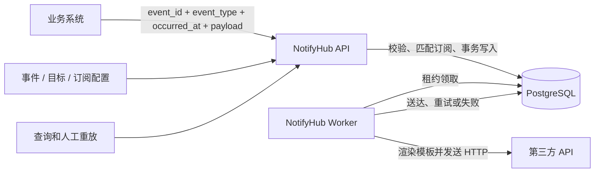
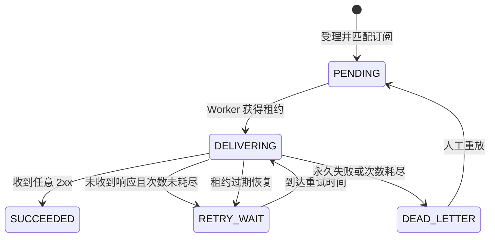

# NotifyHub Demo 技术设计

> 文档状态：V1.3（MVP 实现基线）
> 更新日期：2026-07-15
> 上游需求：[PRD.md](./PRD.md)

## 1. 设计结论

NotifyHub Demo 聚焦一条核心链路：业务系统提交一个有明确定义的系统事件，NotifyHub 根据有效订阅找到一个或多个第三方 API，将事件转换成各 API 需要的 HTTP 请求，可靠持久化后异步投递。

首版采用以下方案：

- 使用 Go 实现 API 和异步 Worker。
- 使用 PostgreSQL 保存事件、投递任务、尝试记录和失败任务，并充当持久化任务队列。
- 使用配置文件管理事件定义、第三方 API 和订阅关系。
- 事件类型使用带版本的稳定唯一 ID；事件实例由业务系统提供唯一 `event_id`。
- 订阅支持生效时间和失效时间，例如只订阅 2026 年 6 月发生的事件。
- 业务系统只提交规范事件载荷，不感知当前有哪些第三方订阅者。
- 订阅通过请求模板把规范事件载荷转换成目标 API 的 Header 和 Body。
- NotifyHub 不解析外部 API 的响应 Body 或业务返回字段；只有任意 `2xx` 被视为接收确认。
- 没有收到响应、连接失败、请求写入结果不确定、`408`、`429` 或 `5xx` 时执行重试，允许重复投递。
- 自动重试耗尽后任务仍持久化保存，第三方恢复后可人工重放。

## 2. “不关心返回值”与可靠送达

### 2.1 送达判定

原始需求中的“不需要关心外部 API 的返回值”解释为：

- 不解析响应 Body。
- 不根据响应 Body 判断供应商业务是否成功。
- 不把供应商响应返回给内部业务系统。
- 不解析响应 Body，但使用 HTTP 状态码区分传输确认、可重试失败和永久失败。

但 HTTP 系统仍需要一个传输层确认，否则无法判断请求是否到达。Demo 使用以下判定：

| 外部调用结果 | 是否认为送达 | 后续处理 |
| --- | --- | --- |
| 收到任意 `2xx` | 是 | 标记 `SUCCEEDED`，不再重试 |
| 收到 `408`、`429` 或 `5xx` | 否 | 按退避策略重试 |
| 收到其他 `4xx` 或 `3xx` | 否 | 标记 `DEAD_LETTER`，等待人工处理 |
| DNS、建连或 TLS 失败 | 否 | 重试 |
| 请求 Body 未完整写出 | 否 | 重试 |
| 请求已写出但等待响应超时 | 不确定 | 为避免漏送而重试，可能重复 |
| 连接在收到完整响应头前中断 | 不确定 | 重试，可能重复 |

HTTP 状态码保存在尝试记录中并决定状态转换。响应 Body 读取后立即丢弃，不进入数据库和业务响应。

### 2.2 系统保证与限制

NotifyHub 保证的是按约定协议把请求可靠投递并取得 `2xx` 接收确认，不保证第三方内部后续业务消费成功。第三方自定义响应字段和异步处理结果超出 NotifyHub 系统边界；若需要更强保证，必须增加独立回执协议。

### 2.3 投递语义

Demo 选择**至少一次投递**：

- 任务在成功受理后至少会被 Worker 尝试发送一次。
- 未收到 HTTP 响应的任务不会被当作已送达。
- 送达结果不确定时选择重试，因此同一个通知可能到达第三方多次。
- 如果第三方支持幂等 Header，NotifyHub 可配置透传 `event_id`，由第三方自行去重。

## 3. PostgreSQL 可靠性判断

### 3.1 PostgreSQL 可以支撑 Demo 的至少一次保证

必须满足以下条件：

1. 事件和全部投递任务在同一个 PostgreSQL 事务中创建。
2. 事务提交成功后 API 才返回 `202 Accepted`。
3. 使用普通持久化表，不使用 `UNLOGGED` 表。
4. PostgreSQL 保持 `synchronous_commit=on`，保证提交时 WAL 已落盘。
5. Worker 领取任务时只设置租约，不删除任务。
6. 收到 `2xx` 并成功提交状态事务后才标记 `SUCCEEDED`。
7. Worker 崩溃后通过租约过期重新领取未确认任务。
8. 自动重试耗尽后任务进入 `DEAD_LETTER`，但记录不删除。

### 3.2 故障窗口

| 故障位置 | 数据库状态 | 恢复结果 |
| --- | --- | --- |
| API 事务提交前崩溃 | 没有已受理事件 | 调用方用相同 `event_id` 重试 |
| 事务已提交但 API 响应丢失 | 事件已存在 | 重试命中幂等记录，不重复创建 |
| Worker 在发送前崩溃 | 任务处于过期租约 | 重新领取并发送 |
| 第三方已收到但 Worker 写状态前崩溃 | 数据库仍未确认送达 | 重新发送，可能重复但不会漏送 |
| PostgreSQL 暂时不可用 | 已提交数据仍存在 | 恢复后继续投递 |

Demo 验证的是应用和进程故障下的可靠性。正式企业部署还需要 PostgreSQL 主备、备份和恢复演练来处理数据库主机或磁盘灾难。

## 4. 系统边界

### 4.1 Demo 解决的问题

- 系统事件定义、版本和实例唯一标识。
- 事件到第三方 API 的订阅及有效期管理。
- 一个事件匹配多个订阅并生成独立投递任务。
- 不同 API 的 URL、方法、Header、鉴权和 Body 模板。
- 幂等受理、可靠持久化、异步投递、重试、失败保存和重放。
- 查询事件、订阅匹配结果、投递状态和尝试历史。

### 4.2 Demo 不解决的问题

| 不解决的问题 | 判断依据 |
| --- | --- |
| 判断第三方内部业务处理成功 | 系统只确认 `2xx` 接收，不解析响应 Body，也不追踪第三方内部后续处理 |
| 任意临时 URL | Demo 使用配置目标即可，也避免引入复杂 SSRF 防护 |
| 业务数据库事务和事件提交原子性 | 由业务系统负责；正式环境可在业务侧使用 Outbox |
| 严格仅一次 | 请求送达但响应丢失时必须在漏送和重复之间选择，系统选择重复 |
| 事件历史回放给新增订阅 | 新订阅默认只影响配置生效后受理的事件，历史补发留作演进能力 |
| 跨订阅事务 | 每个第三方独立；一个目标失败不阻塞其他目标 |
| 任意脚本转换 | Demo 只提供受限请求模板，不允许运行自定义代码 |
| 管理后台和配置热更新 | 配置文件加滚动重启足够验证核心能力 |
| 完整监控平台 | 只保留状态查询、健康检查和基础日志 |

## 5. 配置模型

映射关系存放在配置文件中，但不再使用简单的 `routes`。配置拆分为四类：

```text
configs/
├── sources.yaml        # 内部事件生产系统
├── events.yaml         # 系统事件定义
├── targets.yaml        # 第三方 API 定义
├── subscriptions.yaml  # 事件到 API 的订阅、有效期和请求模板
└── schemas/            # 事件 JSON Schema
```

拆分配置的目的不是增加组件，而是使事件、API 和订阅可以独立增加和版本管理。应用启动时加载整个目录，完成交叉校验后生成一个不可变配置快照和配置版本哈希。

## 6. 系统事件定义

### 6.1 事件类型唯一标识

事件类型 ID 使用：

```text
<业务域>.<实体>.<动作>.v<主版本>
```

示例：

- `identity.user.registered.v1`
- `billing.subscription.succeeded.v1`
- `commerce.order.paid.v1`

规则：

- ID 在 NotifyHub 配置中全局唯一。
- ID 一旦使用不得改变含义。
- 可选字段增加等兼容修改保留原版本。
- 删除字段、改变类型或语义等不兼容修改创建 `.v2`。
- V1 和 V2 可以同时存在，各自拥有独立订阅。

### 6.2 事件实例唯一标识

每次业务事实发生时，生产系统生成一个稳定的 `event_id`，推荐 UUID 或 ULID。NotifyHub 使用以下数据库唯一约束：

```sql
UNIQUE (source_system, event_id)
```

同一来源使用相同 `event_id` 重试且请求内容一致时，返回原事件；内容不一致时返回 `409 IDEMPOTENCY_CONFLICT`。

事件类型 ID 表示“发生了什么”，事件实例 ID 表示“具体发生的哪一次”，两者不能互相替代。

### 6.3 事件时间

事件请求必须包含：

- `occurred_at`：业务事实实际发生时间，RFC 3339 UTC 时间。
- `event_id`：事件实例 ID。
- `event_type`：带版本的事件类型 ID。

订阅有效期按 `occurred_at` 判断，而不是 API 接收时间。这样 6 月 30 日发生、7 月 1 日延迟提交的事件仍可匹配“只订阅到 6 月底”的订阅。

### 6.4 事件定义配置

```yaml
events:
  - id: identity.user.registered.v1
    source: user-service
    description: 用户完成注册
    schema: schemas/identity.user.registered.v1.json
    enabled: true

  - id: billing.subscription.succeeded.v1
    source: subscription-service
    description: 用户订阅付款成功
    schema: schemas/billing.subscription.succeeded.v1.json
    enabled: true

  - id: commerce.order.paid.v1
    source: order-service
    description: 订单支付成功
    schema: schemas/commerce.order.paid.v1.json
    enabled: true
```

事件载荷在受理时按 JSON Schema 校验。Schema 的作用是让订阅模板可以依赖稳定字段，也能在新增第三方订阅前判断当前事件是否包含所需数据。

## 7. 第三方 API 定义

目标配置只描述如何访问第三方，不描述订阅什么事件：

```yaml
targets:
  - id: ads-conversion-api
    revision: 1
    url: https://ads.example.com/api/conversions
    method: POST
    headers:
      Accept: application/json
    secret_headers:
      Authorization: ADS_API_AUTH
    timeout_ms: 10000
    idempotency_header: X-Event-ID
    enabled: true

  - id: crm-contact-api
    revision: 1
    url: https://crm.example.com/api/contacts/status
    method: PUT
    headers:
      Accept: application/json
    secret_headers:
      X-API-Key: CRM_API_KEY
    timeout_ms: 10000
    idempotency_header: X-Request-ID
    enabled: true
```

目标 ID 稳定不变。URL、鉴权或超时修改时增加 `revision`，使投递历史能说明使用了哪个版本。

## 8. 订阅与时效性

### 8.1 订阅定义

订阅是事件与目标 API 之间的映射实体：

```yaml
subscriptions:
  - id: user-registration-to-ads-2026-h1
    revision: 1
    event_type: identity.user.registered.v1
    target_id: ads-conversion-api
    valid_from: 2026-01-01T00:00:00Z
    valid_until: 2026-07-01T00:00:00Z
    content_type: application/json
    body_template: |
      {
        "conversion_id": {{ json .event_id }},
        "user_id": {{ json .payload.user_id }},
        "registered_at": {{ json .occurred_at }}
      }
    enabled: true

  - id: subscription-success-to-crm
    revision: 1
    event_type: billing.subscription.succeeded.v1
    target_id: crm-contact-api
    valid_from: 2026-01-01T00:00:00Z
    valid_until: null
    content_type: application/json
    body_template: |
      {
        "contact_id": {{ json .payload.contact_id }},
        "status": "subscribed"
      }
    enabled: true
```

### 8.2 时间窗口规则

订阅窗口采用左闭右开区间：

```text
valid_from <= occurred_at < valid_until
```

- `valid_from` 为空表示立即生效。
- `valid_until` 为空表示长期有效。
- “只订阅到 2026 年 6 月”应配置 `valid_until: 2026-07-01T00:00:00Z`。
- 时间统一使用 UTC，避免服务器时区和夏令时歧义。
- 同一事件与目标的有效窗口不允许重叠，避免一个业务事件意外生成两条相同目标投递。

### 8.3 匹配时机与配置快照

事件受理时执行一次订阅匹配，并把以下内容保存到投递任务：

- 订阅 ID 和 revision；
- 目标 ID 和 revision；
- 目标 URL、方法、Header、密钥引用和超时；
- 内容类型和 Body 模板；
- 整体配置版本。

后续订阅新增、失效或修改不会改变已受理事件的投递集合。这样每个事件为何投递或为何未投递都可以由当时配置解释。

### 8.4 没有有效订阅

事件定义合法但没有有效订阅时：

- 事件仍然持久化并返回 `202 Accepted`。
- 不创建投递任务。
- 事件状态为 `NO_SUBSCRIBER`。
- 查询响应返回 `matched_subscriptions: 0`。

这不是错误。例如订阅只到 6 月，7 月发生的事件不应该发送。

### 8.5 新增与变更规则

#### 新增事件

1. 在 `events.yaml` 增加新的版本化事件定义。
2. 增加对应 JSON Schema。
3. 生产系统开始发送该 `event_type`。
4. 没有订阅时事件可以被接收，但不会产生投递。

#### 新增第三方 API

1. 在 `targets.yaml` 增加目标配置和密钥环境变量。
2. 目标尚未被订阅时不会收到任何事件。

#### 新增订阅

1. 在 `subscriptions.yaml` 增加事件、目标、有效期和请求模板。
2. 模板只能使用事件 Schema 中存在的字段。
3. 配置发布后，新受理且 `occurred_at` 落在窗口内的事件开始匹配。
4. 生产者不需要知道新增的目标，也不需要改变提交接口。

#### 停止订阅

优先设置 `valid_until` 或 `enabled: false`，不直接删除订阅 ID。保留定义有利于失败任务重放和历史解释。

#### 历史事件

新增订阅不会自动扫描并补发已经受理的历史事件。历史回放需要范围、速率和重复风险控制，属于正式版本演进能力，不在 Demo 中实现。

## 9. 请求模板

### 9.1 为什么需要模板

如果由生产者按目标 API 提供 Body，生产者就必须知道所有订阅者；每新增一个第三方都需要修改业务系统，与“灵活增加订阅”冲突。

Demo 使用订阅级请求模板，把规范事件转换成目标请求。生产者只关心事件定义，NotifyHub 配置负责第三方差异。

### 9.2 模板能力边界

- 使用 Go `text/template` 语法。
- 只暴露 `.event_id`、`.event_type`、`.occurred_at` 和 `.payload`。
- 只提供 `json` 转义函数，不提供文件、网络、环境变量或任意函数调用。
- 缺少字段时模板执行失败，不以空字符串静默替代。
- `application/json` 输出必须再次解析为合法 JSON。
- 渲染后 Body 最大 1 MB。
- 鉴权信息不进入模板，由目标的 `secret_headers` 注入。

模板语法在配置启动时检查；字段存在性结合事件 JSON Schema 检查。运行时渲染失败的投递进入 `DEAD_LETTER` 并保留错误原因，不影响同一事件的其他订阅。

## 10. 总体架构



### 10.1 API 进程

- 根据 API Key 确定来源系统。
- 校验事件类型、来源权限、时间和 JSON Schema。
- 查找在 `occurred_at` 时有效的全部订阅。
- 在同一事务中保存事件和每个订阅对应的投递任务。
- 提供事件、投递、尝试、失败任务和重放接口。

### 10.2 Worker 进程

- 使用数据库租约领取待投递任务。
- 根据任务内的配置快照渲染请求 Body。
- 注入目标静态 Header、密钥 Header 和可选幂等 Header。
- 发送 HTTP 请求并丢弃响应 Body。
- 收到任意 `2xx` 时标记 `SUCCEEDED`。
- 未收到响应、`408`、`429` 或 `5xx` 时重试；耗尽后进入 `DEAD_LETTER`。

### 10.3 部署

- 一个 Go 工程、一个二进制。
- `notifyhub api` 和 `notifyhub worker` 使用不同启动命令。
- Demo 各运行一个实例并连接同一个 PostgreSQL。
- 配置变更通过“校验配置 → 重启 API/Worker”生效，不实现热更新。

## 11. 数据模型

### 11.1 `events`

| 字段 | 类型 | 说明 |
| --- | --- | --- |
| `id` | UUID PK | NotifyHub 内部事件 ID |
| `source_system` | VARCHAR(64) | 由 API Key 得到 |
| `event_id` | VARCHAR(128) | 生产系统事件实例 ID |
| `event_type` | VARCHAR(160) | 带版本的事件类型 ID |
| `occurred_at` | TIMESTAMPTZ | 业务发生时间 |
| `payload` | JSONB | 规范事件载荷 |
| `request_fingerprint` | CHAR(64) | 幂等冲突检测 |
| `config_version` | CHAR(64) | 受理配置版本 |
| `matched_subscriptions` | INTEGER | 匹配订阅数 |
| `created_at` | TIMESTAMPTZ | 受理时间 |

唯一约束：`UNIQUE (source_system, event_id)`。

### 11.2 `deliveries`

| 字段 | 类型 | 说明 |
| --- | --- | --- |
| `id` | UUID PK | 投递 ID |
| `event_pk` | UUID FK | 所属事件 |
| `subscription_id` | VARCHAR(128) | 匹配订阅 ID |
| `target_id` | VARCHAR(128) | 目标 ID |
| `request_snapshot` | JSONB | 订阅和目标配置快照，不含密钥值 |
| `status` | VARCHAR(24) | 投递状态 |
| `cycle_no` | INTEGER | 首次为 1，每次重放加 1 |
| `attempt_no` | SMALLINT | 当前周期尝试次数 |
| `next_attempt_at` | TIMESTAMPTZ | 下次可投递时间 |
| `lease_owner` | VARCHAR(128), nullable | Worker ID |
| `lease_until` | TIMESTAMPTZ, nullable | 租约截止时间 |
| `last_error` | VARCHAR(512), nullable | 脱敏、截断的错误摘要 |
| `created_at` / `updated_at` | TIMESTAMPTZ | 时间字段 |

约束：`UNIQUE (event_pk, subscription_id)`。

领取索引：

```sql
CREATE INDEX idx_deliveries_due
ON deliveries (next_attempt_at, id)
WHERE status IN ('PENDING', 'RETRY_WAIT');
```

### 11.3 `delivery_attempts`

保存投递 ID、周期、尝试序号、开始与结束时间、是否收到 HTTP 响应、HTTP 状态码、传输错误和耗时。响应 Body、事件 Payload、API Key 和鉴权 Header 不写入尝试记录。

约束：`UNIQUE (delivery_id, cycle_no, attempt_no)`。

### 11.4 `delivery_replays`

保存投递 ID、原周期、新周期、重放原因、使用的旧/新配置版本和时间。

### 11.5 数据保留

- `DEAD_LETTER` 投递不自动删除。
- Demo 只清理超过 30 天且全部投递为 `SUCCEEDED` 或 `NO_SUBSCRIBER` 的事件。
- 失败任务重放成功后，旧尝试历史仍保留到事件清理。

## 12. 状态机



事件聚合状态：

- 没有匹配订阅：`NO_SUBSCRIBER`。
- 所有投递均为 `SUCCEEDED`：`SUCCEEDED`。
- 部分已送达，部分处理中或失败：`PARTIAL`。
- 全部失败：`DEAD_LETTER`。
- 其他情况：`PROCESSING`。

## 13. API 设计

### 13.1 提交事件

`POST /api/v1/events`

```json
{
  "event_id": "01JZP2A3B4C5D6E7F8G9H0JKL1",
  "event_type": "identity.user.registered.v1",
  "occurred_at": "2026-06-30T15:30:00Z",
  "payload": {
    "user_id": "u-10001",
    "channel": "summer-campaign"
  }
}
```

响应：

```json
{
  "id": "0198abc1-0000-7000-8000-000000000001",
  "event_id": "01JZP2A3B4C5D6E7F8G9H0JKL1",
  "status": "PROCESSING",
  "duplicate": false,
  "matched_subscriptions": 1,
  "deliveries": [
    {
      "id": "0198abc1-0000-7000-8000-000000000002",
      "subscription_id": "user-registration-to-ads-2026-h1",
      "target_id": "ads-conversion-api",
      "status": "PENDING"
    }
  ]
}
```

新事件和相同内容的幂等重复均返回 `202`。幂等重复返回原事件和当前投递状态。

### 13.2 查询和重放

| 方法与路径 | 作用 |
| --- | --- |
| `GET /api/v1/events/{id}` | 查询事件、匹配订阅和聚合状态 |
| `GET /api/v1/deliveries/{id}` | 查询单个订阅投递状态 |
| `GET /api/v1/deliveries/{id}/attempts` | 查询传输尝试历史 |
| `GET /api/v1/failed-deliveries` | 分页查询持久化失败任务 |
| `POST /api/v1/deliveries/{id}/replay` | 重放一个 `DEAD_LETTER` 投递 |

人工重放不重新计算事件应该匹配哪些订阅，只重放原投递。若配置中仍存在相同订阅和目标 ID，则使用最新 revision 生成新快照；配置已移除时使用原快照。重放不重新检查订阅有效期，因为该事件在最初受理时已经合法匹配。

### 13.3 错误响应

| HTTP 状态 | 错误码 | 场景 |
| --- | --- | --- |
| 400 | `INVALID_REQUEST` | 字段、时间或 JSON 格式错误 |
| 401 | `UNAUTHORIZED` | API Key 无效 |
| 404 | `EVENT_TYPE_NOT_FOUND` | 未定义事件类型 |
| 409 | `IDEMPOTENCY_CONFLICT` | 相同事件 ID 对应不同内容 |
| 413 | `PAYLOAD_TOO_LARGE` | 事件 Payload 超过 1 MB |
| 422 | `EVENT_SCHEMA_VIOLATION` | Payload 不符合事件 Schema |
| 503 | `PERSISTENCE_UNAVAILABLE` | PostgreSQL 事务无法提交，可用相同事件 ID 重试 |

## 14. 异步投递与失败处理

### 14.1 领取任务

Worker 使用短事务和 `FOR UPDATE SKIP LOCKED` 批量领取：

```sql
SELECT id
FROM deliveries
WHERE status IN ('PENDING', 'RETRY_WAIT')
  AND next_attempt_at <= clock_timestamp()
ORDER BY next_attempt_at, id
FOR UPDATE SKIP LOCKED
LIMIT 50;
```

同一领取事务设置 `DELIVERING`、60 秒租约并增加尝试序号。提交后才渲染和发送 HTTP 请求，避免在网络等待期间持有数据库锁。

### 14.2 重试计划

每个周期最多 7 次尝试：首次立即执行，随后等待 1 分钟、5 分钟、30 分钟、2 小时、6 小时、24 小时。

重试由传输失败、送达结果不确定、`408`、`429` 和 `5xx` 触发；其他 `4xx` 与 `3xx` 不自动重试。

### 14.3 长期不可用

1. 建连失败、请求写入失败或响应超时按固定计划重试。
2. 7 次尝试仍未获得 `2xx` 时进入 `DEAD_LETTER`。
3. `DEAD_LETTER` 记录和全部尝试历史继续保存在 PostgreSQL。
4. 运维人员确认第三方恢复后执行人工重放，开启新的尝试周期。
5. 重放成功前不删除失败记录。

不使用无限自动重试，因为错误 URL、永久网络隔离或第三方下线不会自行恢复。持久化失败加人工重放能清楚展示系统边界，也避免 Demo 无限积压。

## 15. 配置发布与灵活扩展

### 15.1 Demo 发布流程

1. 修改或增加事件、目标、订阅及 Schema 文件。
2. 执行 `notifyhub config validate`。
3. 校验通过后生成配置版本哈希。
4. 重启 API 和 Worker，使新配置生效。
5. 新受理事件使用新配置，已有投递继续使用快照。

配置校验至少检查：

- 所有 ID 唯一且引用存在。
- 事件来源与生产系统一致。
- JSON Schema 和模板语法合法。
- 模板引用字段存在于事件 Schema。
- 时间格式、窗口顺序和重叠规则正确。
- 目标 HTTPS URL、方法、超时和密钥环境变量有效。
- 禁用事件、目标不能被启用订阅引用。

### 15.2 灵活性的来源

- 增加新事件：新增事件定义和 Schema，不改 NotifyHub 代码。
- 增加新 API：新增目标配置，不改生产者代码。
- 增加映射：新增订阅和模板，不改事件生产者。
- 限时订阅：通过 `valid_from`/`valid_until` 控制，不发布业务代码。
- Payload 不兼容：创建事件 `.v2`，让旧订阅继续使用 `.v1`。
- 配置修复：增加 revision，失败任务人工重放时可以使用新版配置。

Demo 没有热加载，但配置变化不要求编译代码。正式版本如果变更频繁，再把相同模型迁移到数据库和配置 API；数据结构无需推翻。

## 16. 中间件取舍

### 16.1 选择 PostgreSQL 任务表

原因：

- 事件、订阅匹配结果和投递任务可在同一事务中保存。
- 没有数据库与消息队列双写不一致。
- 延迟重试、失败保存和查询都可以直接使用 SQL。
- 当前 10～50 QPS 和 10 万积压不需要独立消息队列。

### 16.2 替代方案

如果不使用 PostgreSQL 任务表，可使用 PostgreSQL 状态库 + Transactional Outbox + RabbitMQ。Outbox Relay 在事务后把投递任务发布到 RabbitMQ，适合更高吞吐和更多 Worker，但增加队列集群、Relay、确认和排障路径，不适合 Demo。

Kafka 适合多消费者事件流和长期回放。本系统当前需要的是有状态工作队列和延迟重试，使用 Kafka 属于过度设计。

内存队列在进程重启时丢失任务，无法满足可靠性要求，不作为替代方案。

## 17. 被拒绝的过度设计

| 设计 | Demo 决定 |
| --- | --- |
| 任意 URL 及完整 SSRF 防护 | 不开放任意 URL，只使用配置目标 |
| Prometheus、Grafana、分布式追踪 | 只保留查询、健康检查和结构化日志 |
| Kafka、RabbitMQ | PostgreSQL 已满足 Demo 的持久化和调度规模 |
| 配置中心和管理后台 | 文件配置、校验命令和重启 |
| 通用脚本或工作流引擎 | 使用受限请求模板 |
| 自动历史事件回放 | 新订阅只影响新受理事件，历史回放后续演进 |
| 动态熔断和无限重试 | 固定重试后持久化失败 |
| 微服务拆分 | 一个 Go 工程，API/Worker 分角色运行 |

## 18. 基础日志与健康检查

Demo 只输出结构化日志，包含事件 ID、投递 ID、订阅 ID、目标 ID、状态、尝试次数、是否收到响应、HTTP 状态和传输错误。日志不输出 Payload、响应 Body、API Key 或鉴权 Header。

仅提供：

- `GET /health/live`：进程可响应。
- `GET /health/ready`：配置有效且 PostgreSQL 可用。
- 事件、投递、尝试和失败查询接口。

不实现指标、自动告警和链路追踪。

## 19. 测试重点

### 19.1 事件和订阅

- 事件类型 ID 和实例 ID 唯一约束。
- Payload JSON Schema 校验。
- `.v1`、`.v2` 独立匹配订阅。
- `valid_from` 包含边界，`valid_until` 不包含边界。
- 6 月发生、7 月延迟到达的事件仍匹配 6 月订阅。
- 7 月发生的事件不匹配 6 月订阅并进入 `NO_SUBSCRIBER`。
- 一个事件匹配多个订阅并原子创建多条投递。
- 新增目标和订阅不要求修改生产者请求格式。

### 19.2 HTTP 送达

- 任意 2xx 标记 `SUCCEEDED`；408、429、5xx 重试；其他 4xx 和 3xx 进入 `DEAD_LETTER`；响应 Body 被丢弃。
- DNS、建连、TLS、写入失败进入重试。
- 请求写出后响应超时进入重试并允许重复。
- 幂等 Header 正确使用事件 ID。
- 模板渲染错误只使对应订阅进入 `DEAD_LETTER`。

### 19.3 PostgreSQL 可靠性

- 事务失败时 API 不返回 202。
- 响应丢失后重复提交只存在一条事件记录。
- Worker 崩溃后租约过期重新投递。
- 第三方已收到、状态未提交时崩溃会重复但不漏送。
- 7 次失败后数据和尝试历史仍存在。
- 重放使用新 revision 且保留旧配置版本记录。

### 19.4 Demo 演示

1. 配置三个事件、三个目标和包含时效窗口的订阅。
2. 提交 6 月事件，展示订阅匹配和异步投递。
3. 提交订阅失效后的事件，展示 `NO_SUBSCRIBER`。
4. 模拟第三方无响应，展示重试、重启恢复和 `DEAD_LETTER` 持久化。
5. 恢复第三方并人工重放，收到 `2xx` 后变为 `SUCCEEDED`。
6. 新增第三方目标及订阅，重启配置后无需修改生产者即可开始投递。

## 20. 后续代码结构

```text
cmd/notifyhub/          # api、worker、migrate、config validate
internal/config/       # sources、events、targets、subscriptions 和快照
internal/domain/       # Event、Subscription、Delivery、Attempt 和状态机
internal/application/  # 提交、匹配、查询、投递和重放用例
internal/template/     # 受限请求模板和输出校验
internal/httpapi/      # API、认证、DTO 和错误响应
internal/storage/      # PostgreSQL repository、事务和迁移
internal/worker/       # 租约领取、HTTP 投递和恢复
internal/logging/      # 基础结构化日志与脱敏
migrations/            # PostgreSQL 表结构
configs/               # Demo 配置、Schema 和示例密钥名
```
